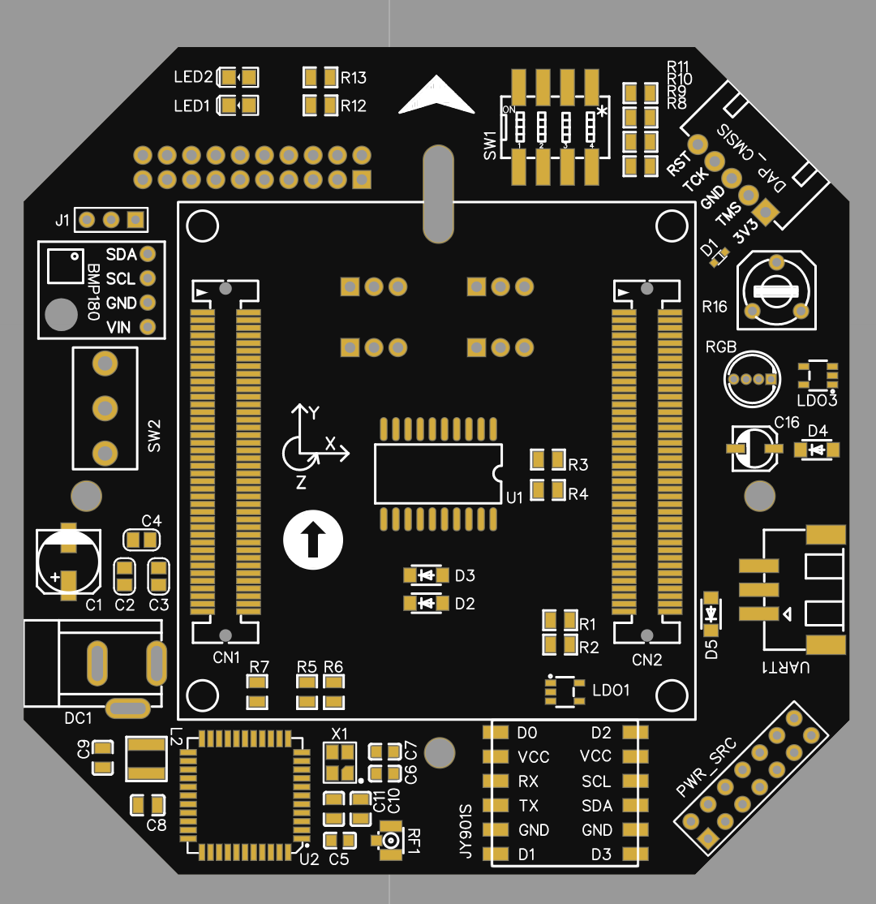

# Quadrotor | QuadOS

 

This project aims to provide a reliable solution for quadrotor OS. In this repository, it includes scheme sheets, code, IO pins addtribution. I migrated some of BSP driver program using a C++ structure and it is completely hardware independent.

- **Hardware**

  `NXP iMX.RT1052(Cortex M7)` | `MPU6050` | `OV5640` | `HobbyWing` | `BMP180` | `AP6181(WiFi)`

- **Software**

  `freeRTOS` | `ARM GCC`

 

## File Structure

| Directory                | Description                                                  |
| ------------------------ | ------------------------------------------------------------ |
| [libraries](./libraries) | [read more]() - Support package for `cortex M7`              |
| [plus](./plus)           | [read more]() - System interconnection layer and attitude control algorithm |
| [mpu6050](./MPU6050_DMP) | [read more]() - Firmware for  triple-axis MEMS gyroscope     |
| [freeRTOS](./FreeRTOS)   | [read more]() - Core embedded operating system               |

## Why Cortex M7

The i.MX RT1050 is the industry's first crossover MCU and combines the high-performance and high level of integration on an applications processors with the ease of use and real-time functionality of a microcontroller. The i.MX RT1050 runs on the Arm® Cortex®-M7 core at 600 MHz.

> + 3020 CoreMark/1284 DMIPS @ 600 MHz 
> + Up to 512 kB Tightly Coupled Memory (TCM)
> + FreeRTOS support available with MCUXpresso SDK
> + Real-time, low-latency response as low as 20 ns
> + Industry’s lowest dynamic power with an integrated DC-DC converter
> + Low-power run modes at 24 MHz
> + Parallel camera sensor interface
> + LCD display controller (up to WXGA 1366x768)
> + 3x I2S for high-performance, multichannel audio
> + Extensive external memory interface options
> + NAND, eMMC, QuadSPI NOR Flash, and Parallel NOR Flash
> + Wireless connectivity interface for Wi-Fi®, Bluetooth®, Bluetooth Low Energy, ZigBee® and Thread™

### MPU6050
The triple-axis MEMS gyroscope in the MPU-60X0 includes a wide range of features:
>+ Digital-output X-, Y-, and Z-Axis angular rate sensors (gyroscopes) with a user-programmable full-scale range of ±250, ±500, ±1000, and ±2000°/sec
>+ External sync signal connected to the FSYNC pin supports image, video and GPS synchronization
>+ Integrated 16-bit ADCs enable simultaneous sampling of gyros
>+ Enhanced bias and sensitivity temperature stability reduces the need for user calibration
>+ Improved low-frequency noise performance
>+ Digitally-programmable low-pass filter
>+ Gyroscope operating current: 3.6mA
>+ Standby current: 5μA
>+ Factory calibrated sensitivity scale factor
>+ User self-test

Accelerometer Features:

>+ Digital-output triple-axis accelerometer with a programmable full scale range of ±2g, ±4g, ±8g and ±16g
>+ Integrated 16-bit ADCs enable simultaneous sampling of accelerometers while requiring no external multiplexer
>+ Accelerometer normal operating current: 500μA
>+ Low power accelerometer mode current: 10μA at 1.25Hz, 20μA at 5Hz, 60μA at 20Hz, 110μA at 40Hz
>+ Orientation detection and signaling
>+ Tap detection
>+ User-programmable interrupts
>+ High-G interrupt
>+ User self-test

### OV5640

## 

